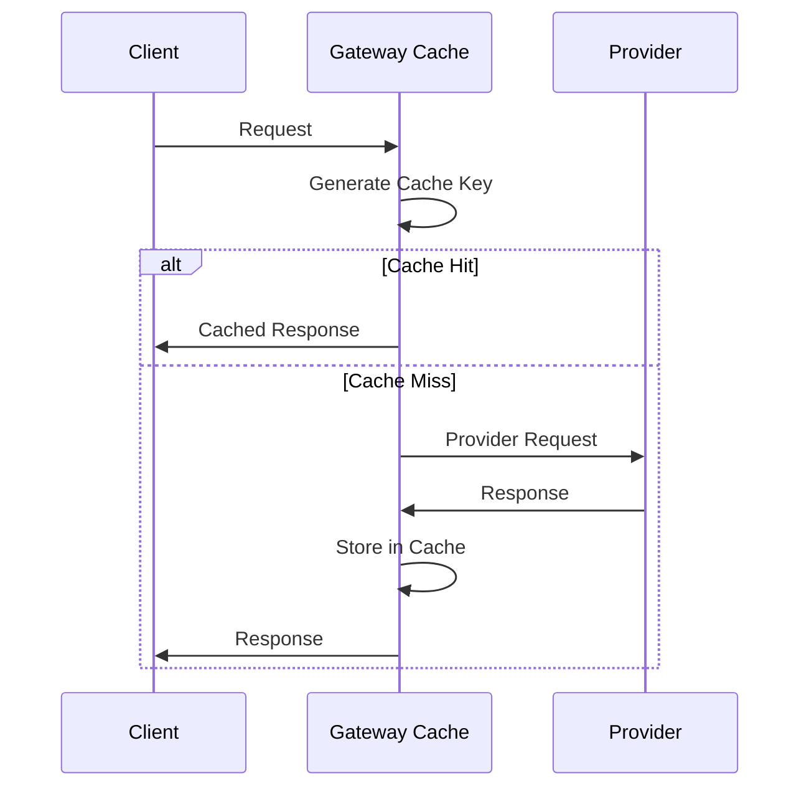

The Portkey AI Gateway includes built-in caching to reduce latency and API costs by storing and reusing LLM responses. The caching system supports both simple and semantic caching modes.

## How Caching Works

When caching is enabled, the gateway:

1. **Generates a cache key** from the request body and URL
2. **Checks for a cached response** before making the provider request
3. **Returns the cached response** if found and not expired
4. **Makes the provider request** if cache miss
5. **Stores the response** in cache for future requests



## Cache Configuration

### Enable Caching

Caching can be enabled globally or per-request:

**Global configuration** (`conf.json`):
```json
{
  "cache": true
}
```

**Per-request configuration**:
```json
{
  "provider": "openai",
  "api_key": "sk-...",
  "cache": {
    "mode": "simple",
    "max_age": 3600000
  }
}
```

### Cache Modes

#### Simple Caching

Caches based on exact request match:

```json
{
  "cache": {
    "mode": "simple",
    "max_age": 3600000  // 1 hour in milliseconds
  }
}
```

**How it works:**
- Request body and URL are hashed to create a cache key
- Exact match required for cache hit
- TTL (time-to-live) specified by `max_age`
- Default TTL is 24 hours (86,400,000 ms) if not specified

#### Semantic Caching

<Warning>
Semantic caching is available in the hosted and enterprise versions. The open-source gateway currently supports simple caching only.
</Warning>

Semantic caching matches requests with similar meaning:

```json
{
  "cache": {
    "mode": "semantic",
    "max_age": 7200000  // 2 hours
  }
}
```

## Cache Key Generation

The cache key is generated using SHA-256 hashing:

```typescript
const getCacheKey = async (requestBody: any, url: string) => {
  const stringToHash = `${JSON.stringify(requestBody)}-${url}`;
  const encoded = new TextEncoder().encode(stringToHash);
  const hash = await crypto.subtle.digest({ name: 'SHA-256' }, encoded);
  return Array.from(new Uint8Array(hash))
    .map(b => b.toString(16).padStart(2, '0'))
    .join('');
}
```

Source: `src/middlewares/cache/index.ts:14-26`

**What's included in the key:**
- Complete request body (model, messages, temperature, etc.)
- Request URL (provider endpoint)
- All request parameters

**What's excluded:**
- Request headers (except those in the body)
- Timestamps
- User metadata

## Cache Storage

### In-Memory Cache

The default implementation uses in-memory storage:

```typescript
const inMemoryCache: Record<string, CacheEntry> = {};

interface CacheEntry {
  responseBody: string;  // Serialized JSON response
  maxAge: number;        // Expiration timestamp
}
```

Source: `src/middlewares/cache/index.ts:3`

**Characteristics:**
- Fast access (no network calls)
- Lost on gateway restart
- Not shared across gateway instances
- Limited by available memory

### Redis Cache

<Note>
Redis caching is available in Node.js runtime when `REDIS_CONNECTION_STRING` is set.
</Note>

For production deployments, use Redis for persistent, distributed caching:

```bash
REDIS_CONNECTION_STRING=redis://localhost:6379 npm start
```

Redis benefits:
- Persistent across restarts
- Shared across multiple gateway instances
- Configurable eviction policies
- Support for large cache sizes

Source: `src/index.ts:49-51`

## Cache Lifecycle

### Retrieving from Cache

```typescript
const getFromCache = async (
  env: any,
  requestHeaders: any,
  requestBody: any,
  url: string,
  organisationId: string,
  cacheMode: string,
  cacheMaxAge: number | null
) => {
  // Check for force refresh header
  if ('x-portkey-cache-force-refresh' in requestHeaders) {
    return [null, CACHE_STATUS.REFRESH, null];
  }
  
  const cacheKey = await getCacheKey(requestBody, url);
  
  if (cacheKey in inMemoryCache) {
    const cacheObject = inMemoryCache[cacheKey];
    
    // Check expiration
    if (cacheObject.maxAge && cacheObject.maxAge < Date.now()) {
      delete inMemoryCache[cacheKey];
      return [null, CACHE_STATUS.MISS, null];
    }
    
    return [cacheObject.responseBody, CACHE_STATUS.HIT, cacheKey];
  }
  
  return [null, CACHE_STATUS.MISS, null];
}
```

Source: `src/middlewares/cache/index.ts:29-58`

### Storing in Cache

```typescript
const putInCache = async (
  env: any,
  requestHeaders: any,
  requestBody: any,
  responseBody: any,
  url: string,
  organisationId: string,
  cacheMode: string | null,
  cacheMaxAge: number | null
) => {
  // Don't cache streaming responses
  if (requestBody.stream) {
    return;
  }
  
  const cacheKey = await getCacheKey(requestBody, url);
  
  inMemoryCache[cacheKey] = {
    responseBody: JSON.stringify(responseBody),
    maxAge: cacheMaxAge || Date.now() + (24 * 60 * 60 * 1000)
  };
}
```

Source: `src/middlewares/cache/index.ts:60-82`

## Cache Status

The gateway tracks cache operations with status codes:

```typescript
const CACHE_STATUS = {
  HIT: 'HIT',                    // Response served from cache
  SEMANTIC_HIT: 'SEMANTIC HIT',  // Semantic match found
  MISS: 'MISS',                  // No cache entry found
  SEMANTIC_MISS: 'SEMANTIC MISS',// No semantic match
  REFRESH: 'REFRESH',            // Force refresh requested
  DISABLED: 'DISABLED'           // Caching disabled
};
```

Source: `src/middlewares/cache/index.ts:5-12`

## Cache Invalidation

### Force Refresh

Bypass cache and fetch fresh response:

```bash
curl https://gateway.portkey.ai/v1/chat/completions \
  -H "x-portkey-cache-force-refresh: true" \
  -H "x-portkey-config: {...}" \
  -d '{...}'
```

This returns a fresh response and updates the cache.

### Expiration-based

Entries automatically expire when `max_age` is reached:

```json
{
  "cache": {
    "mode": "simple",
    "max_age": 1800000  // 30 minutes
  }
}
```

### Manual Invalidation

For in-memory cache, entries are removed on:
- Gateway restart
- Expiration check during retrieval

For Redis cache:
- Configure TTL in Redis
- Use Redis commands to flush keys
- Implement custom invalidation logic

## Streaming and Caching

<Warning>
Streaming responses cannot be cached. The cache middleware automatically skips streaming requests.
</Warning>

```typescript
if (requestBody.stream) {
  // Does not support caching of streams
  return;
}
```

Reason: Streaming responses are sent incrementally as Server-Sent Events (SSE), making them incompatible with response caching.

Source: `src/middlewares/cache/index.ts:70-73`

## Cache TTL Calculation

The effective TTL is calculated as:

```typescript
const effectiveTTL = cacheMaxAge || (24 * 60 * 60 * 1000);
const expirationTime = Date.now() + effectiveTTL;
```

**Default TTL:** 24 hours (86,400,000 milliseconds)

**Minimum TTL:** No minimum enforced

**Maximum TTL:** No maximum enforced (be mindful of stale data)

Source: `src/middlewares/cache/index.ts:107-108`

## Cache Middleware Integration

The cache middleware is registered in the request pipeline:

```typescript
if (conf.cache === true) {
  app.use('*', memoryCache());
}
```

Source: `src/index.ts:108-110`

The middleware:
1. Runs on all routes (`'*'`)
2. Executes before request handlers
3. Stores responses after successful completion

## Performance Considerations

### Cache Hit Rate

Maximize cache effectiveness:

- Use consistent request parameters
- Avoid random seeds or IDs in requests
- Group similar requests
- Set appropriate TTLs

### Memory Usage

Monitor memory consumption:

```typescript
// Each cache entry size:
const entrySize = 
  JSON.stringify(responseBody).length +  // Response size
  64 +                                    // Cache key (SHA-256)
  8;                                      // maxAge timestamp
```

**Best practices:**
- Set reasonable `max_age` values
- Use Redis for large caches
- Monitor cache size metrics
- Implement cache size limits

### Latency Impact

**Cache hit:** ~0.1-1ms (in-memory) or ~1-5ms (Redis)

**Cache miss:** Full provider latency + cache write time

**Cache key generation:** ~0.1ms (SHA-256 hash)

## Use Cases

### Repeated Queries

```json
{
  "cache": {
    "mode": "simple",
    "max_age": 3600000  // 1 hour
  }
}
```

Ideal for:
- Frequently asked questions
- Product descriptions
- Knowledge base queries
- Code generation for common patterns

### Development/Testing

```json
{
  "cache": {
    "mode": "simple",
    "max_age": 86400000  // 24 hours
  }
}
```

Benefits:
- Faster test runs
- Reduced API costs during development
- Consistent responses for testing

### Short TTL for Dynamic Content

```json
{
  "cache": {
    "mode": "simple",
    "max_age": 300000  // 5 minutes
  }
}
```

Use for:
- News summaries
- Real-time data with some staleness tolerance
- Load reduction during traffic spikes

## Combining with Other Features

### Cache + Fallback

```json
{
  "cache": { "mode": "simple", "max_age": 3600000 },
  "strategy": { "mode": "fallback" },
  "targets": [
    { "provider": "openai", "api_key": "sk-..." },
    { "provider": "anthropic", "api_key": "sk-ant-..." }
  ]
}
```

Cache is checked before routing, so cached responses bypass the entire routing logic.

### Cache + Load Balancing

```json
{
  "cache": { "mode": "simple", "max_age": 1800000 },
  "strategy": { "mode": "loadbalance" },
  "targets": [
    { "provider": "openai", "api_key": "sk-1", "weight": 0.5 },
    { "provider": "openai", "api_key": "sk-2", "weight": 0.5 }
  ]
}
```

Cache hits save costs across all providers.

## Best Practices

<CardGroup cols={2}>

<Card title="Set Appropriate TTLs" icon="clock">
  Balance freshness vs cost savings based on your use case.
</Card>

<Card title="Use Redis for Production" icon="database">
  Deploy Redis for persistent, distributed caching at scale.
</Card>

<Card title="Monitor Cache Metrics" icon="chart-line">
  Track hit rates, memory usage, and cost savings.
</Card>

<Card title="Disable for Real-time" icon="bolt">
  Don't cache time-sensitive or user-specific content.
</Card>

</CardGroup>

## Next Steps

<CardGroup cols={2}>

<Card title="Configs" icon="gear" href="/concepts/configs">
  Learn how to configure caching in gateway configs.
</Card>

<Card title="Routing" icon="route" href="/concepts/routing">
  Understand how caching interacts with routing.
</Card>

<Card title="Load Balancing" icon="scale-balanced" href="/concepts/load-balancing">
  Combine caching with load balancing for optimal performance.
</Card>

<Card title="Deployment" icon="server" href="/deployment/overview">
  Set up Redis caching in production deployments.
</Card>

</CardGroup>