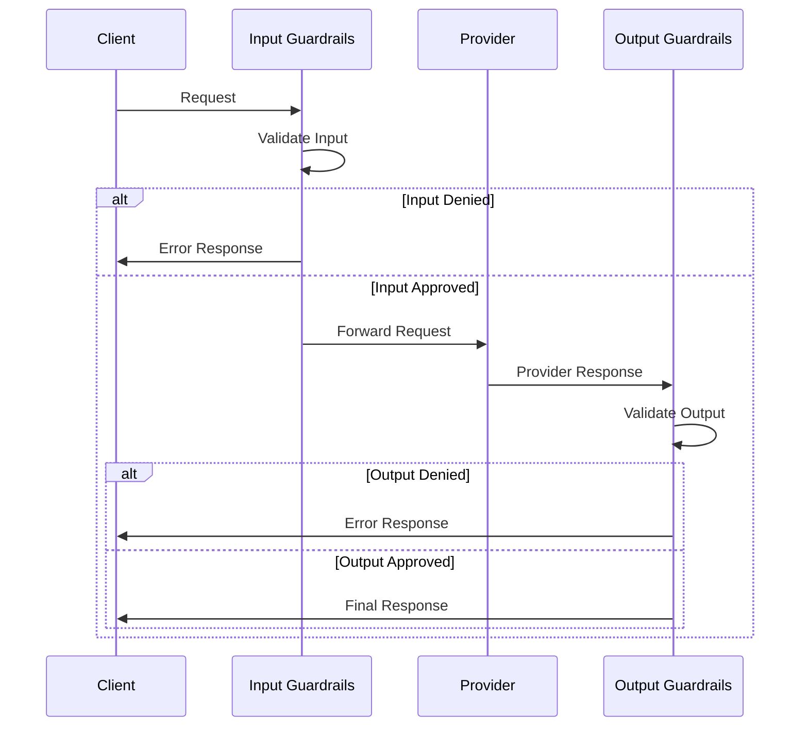

Guardrails provide input and output validation for LLM requests, allowing you to enforce content policies, filter sensitive data, and transform requests/responses. The gateway implements guardrails through a flexible hooks system.

## How Guardrails Work

Guardrails are executed as hooks at two stages:

1. **Input Guardrails** (`before_request_hooks`) - Executed before sending to the provider
2. **Output Guardrails** (`after_request_hooks`) - Executed after receiving provider response



## Guardrail Types

The gateway supports two types of hooks:

### Guardrail Hooks

Validate content without modifying it. Can deny requests/responses.

```json
{
  "input_guardrails": [
    {
      "default.contains": {
        "operator": "none",
        "words": ["sensitive", "confidential"]
      },
      "deny": true
    }
  ]
}
```

### Mutator Hooks

Transform content (redact PII, modify prompts, etc.). Cannot deny requests.

```json
{
  "before_request_hooks": [
    {
      "type": "mutator",
      "id": "pii_redactor",
      "checks": [
        {
          "id": "default.redact_pii",
          "parameters": {
            "patterns": ["email", "phone", "ssn"]
          }
        }
      ]
    }
  ]
}
```

<Note>
Mutator hooks with `async: true` are skipped - mutators must run synchronously to transform the request.
</Note>

Source: `src/middlewares/hooks/index.ts:449-464`

## Built-in Guardrail Checks

The gateway includes default guardrail checks:

### Content Filtering

**contains** - Check for specific words or phrases

```json
{
  "default.contains": {
    "operator": "none",  // "none", "any", "all"
    "words": ["restricted", "blocked"],
    "case_sensitive": false
  },
  "deny": true
}
```

Operators:
- `none` - Deny if ANY word is found
- `any` - Approve if ANY word is found  
- `all` - Approve only if ALL words are found

## Guardrail Configuration

### Shorthand Format

```json
{
  "input_guardrails": [
    {
      "default.contains": {
        "operator": "none",
        "words": ["blocked"]
      },
      "deny": true
    }
  ]
}
```

### Full Hook Format

```json
{
  "before_request_hooks": [
    {
      "type": "guardrail",
      "id": "content_filter",
      "deny": true,
      "async": false,
      "sequential": false,
      "checks": [
        {
          "id": "default.contains",
          "parameters": {
            "operator": "none",
            "words": ["blocked"]
          },
          "is_enabled": true
        }
      ],
      "on_fail": {
        "feedback": {
          "value": "Input contains blocked content",
          "weight": 1.0
        }
      },
      "on_success": {
        "feedback": {
          "value": "Input approved",
          "weight": 1.0
        }
      }
    }
  ]
}
```

### Conversion to Hooks

The gateway automatically converts shorthand guardrails to full hooks:

```typescript
function convertHooksShorthand(guardrails, type, hookType) {
  return guardrails.map(hook => ({
    type: hookType,
    id: `${type}_guardrail_${randomId}`,
    deny: hook.deny,
    async: hook.async,
    checks: Object.keys(hook).map(key => ({
      id: key.includes('.') ? key : `default.${key}`,
      parameters: hook[key]
    }))
  }));
}
```

Source: `src/handlers/handlerUtils.ts:233-275`

## Hook Execution

### Execution Phases

Hooks are executed in four phases:

1. **Sync Before Request** - Synchronous input validation
2. **Async Before Request** - Asynchronous input validation  
3. **Sync After Request** - Synchronous output validation
4. **Async After Request** - Asynchronous output validation

Source: `src/middlewares/hooks/globals.ts`

### Sequential vs Parallel

By default, checks within a hook run in parallel. Set `sequential: true` to run them in sequence:

```json
{
  "type": "guardrail",
  "sequential": true,
  "checks": [
    {"id": "check1", "parameters": {}},
    {"id": "check2", "parameters": {}}
  ]
}
```

**Parallel execution:**
```typescript
const results = await Promise.all(
  checks.map(check => executeCheck(check))
);
```

**Sequential execution:**
```typescript
for (const check of checks) {
  const result = await executeCheck(check);
  // Can update context between checks
}
```

Source: `src/middlewares/hooks/index.ts:366-418`

### Deny Logic

A request/response is denied if:

1. Any hook has `deny: true`
2. That hook's verdict is `false`
3. The check was not skipped

```typescript
const shouldDeny = results.some(
  (result, index) => 
    !result.verdict && 
    hooks[index].deny && 
    !result.skipped
);
```

Source: `src/middlewares/hooks/index.ts:246-275`

## Hook Context

Hooks receive a context object with request and response data:

```typescript
interface HookSpanContext {
  request: {
    json: Record<string, any>;     // Request body
    text: string;                  // Extracted text content
    isStreamingRequest: boolean;
    isTransformed: boolean;        // If mutator modified it
    headers: Record<string, string>;
  };
  response: {
    json: Record<string, any>;     // Response body
    text: string;                  // Extracted text content  
    statusCode: number | null;
    isTransformed: boolean;
  };
  provider: string;
  requestType: string;             // "chatComplete", "complete", etc.
  metadata: Record<string, string>;
}
```

### Text Extraction

The gateway extracts text for validation:

**Request text:**
```typescript
if (request.prompt) return request.prompt;
if (request.messages?.length) {
  const lastMessage = request.messages[request.messages.length - 1];
  return lastMessage.content;
}
if (request.input) return request.input;
```

**Response text:**
```typescript
if (response.choices?.length) {
  const choice = response.choices[0];
  return choice.text || choice.message?.content;
}
```

Source: `src/middlewares/hooks/index.ts:93-161`

## Skip Conditions

Hooks are skipped when:

1. Request type is not `chatComplete`, `complete`, `embed`, or `messages`
2. Request type is `embed` and hook is after request (no output to validate)
3. Request type is `embed` and hook is a mutator
4. After request hook and response status is not 200
5. Before request hook and this is a retry (has parent hook span)
6. Mutator hook with `async: true`

Source: `src/middlewares/hooks/index.ts:449-464`

## Hook Results

Each hook execution returns a result:

```typescript
interface HookResult {
  verdict: boolean;           // Pass/fail
  id: string;                 // Hook ID
  type: HookType;            // "guardrail" or "mutator"
  transformed: boolean;       // If content was modified
  checks: GuardrailCheckResult[];
  feedback: GuardrailFeedback | null;
  execution_time: number;     // Milliseconds
  async: boolean;
  deny: boolean;             // Should deny on failure
  created_at: Date;
  skipped?: boolean;         // If hook was skipped
}

interface GuardrailCheckResult {
  id: string;
  verdict: boolean;
  data: any | null;          // Check-specific data
  error?: { name: string; message: string };
  execution_time: number;
  created_at: Date;
  transformed?: boolean;
  transformedData?: {        // Modified content
    request?: { json: any };
    response?: { json: any };
  };
  log?: any;
  fail_on_error: boolean;
}
```

## Plugin System

Guardrails can be extended through the plugin system:

```typescript
// Plugin structure
interface GuardrailPlugin {
  [checkName: string]: (
    context: HookSpanContext,
    parameters: any,
    eventType: EventType,
    options: HandlerOptions
  ) => Promise<GuardrailCheckResult>;
}
```

Plugins are loaded from the `plugins/` directory and registered in `conf.json`:

```json
{
  "plugins_enabled": [
    "default",
    "portkey",
    "aporia",
    "custom-plugin"
  ]
}
```

Source: `src/middlewares/hooks/index.ts:282-326`

## Example Use Cases

### PII Protection

```json
{
  "input_guardrails": [
    {
      "default.contains": {
        "operator": "none",
        "words": ["ssn", "social security", "password"]
      },
      "deny": true
    }
  ]
}
```

### Content Moderation

```json
{
  "output_guardrails": [
    {
      "default.contains": {
        "operator": "none",
        "words": ["offensive", "inappropriate"]
      },
      "deny": true
    }
  ]
}
```

### Retry on Blocked Output

```json
{
  "retry": { "attempts": 3 },
  "output_guardrails": [
    {
      "default.contains": {
        "operator": "none",
        "words": ["blocked"]
      },
      "deny": true
    }
  ]
}
```

When output is denied, the retry handler will retry with a different provider or configuration.

### Combined Input/Output Validation

```json
{
  "input_guardrails": [
    {
      "default.contains": {
        "operator": "none",
        "words": ["hack", "exploit"]
      },
      "deny": true
    }
  ],
  "output_guardrails": [
    {
      "default.contains": {
        "operator": "any",
        "words": ["safe", "approved"]
      },
      "deny": false
    }
  ]
}
```

## Feedback System

Guardrails can provide feedback on success or failure:

```json
{
  "on_fail": {
    "feedback": {
      "value": "Content policy violation",
      "weight": 1.0,
      "metadata": {
        "violation_type": "profanity"
      }
    }
  },
  "on_success": {
    "feedback": {
      "value": "Content approved",
      "weight": 1.0
    }
  }
}
```

Feedback includes:
- Successful check IDs
- Failed check IDs  
- Errored check IDs

Source: `src/middlewares/hooks/index.ts:466-503`

## Error Handling

Guardrail errors are handled gracefully:

```typescript
try {
  const result = await executeCheck(check);
  return result;
} catch (err) {
  return {
    error: { name: 'Check error', message: 'Error executing check' },
    verdict: false,
    data: null,
    id: check.id,
    execution_time: Date.now() - start,
    created_at: start
  };
}
```

By default, checks with errors fail unless `fail_on_error: false`:

```json
{
  "default.contains": {
    "operator": "none",
    "words": ["test"],
    "failOnError": false  // Don't fail on check errors
  }
}
```

Source: `src/middlewares/hooks/index.ts:282-326`

## Best Practices

<CardGroup cols={2}>

<Card title="Use Input Guardrails First" icon="shield">
  Validate and block malicious input before it reaches the provider to save costs.
</Card>

<Card title="Keep Checks Fast" icon="gauge">
  Guardrails add latency - keep individual checks under 100ms.
</Card>

<Card title="Use Async Sparingly" icon="clock">
  Async hooks don't block the response - use for logging/monitoring only.
</Card>

<Card title="Test Thoroughly" icon="vial">
  Test guardrails with real traffic patterns to avoid false positives.
</Card>

</CardGroup>

## Next Steps

<CardGroup cols={2}>

<Card title="Configs" icon="gear" href="/concepts/configs">
  Learn how to configure guardrails in your gateway config.
</Card>

<Card title="Retries" icon="rotate" href="/features/retries">
  Combine guardrails with retries for robust validation.
</Card>

<Card title="Providers" icon="plug" href="/concepts/providers">
  Understand how guardrails work with different providers.
</Card>

<Card title="Routing" icon="route" href="/concepts/routing">
  Use guardrails with routing strategies.
</Card>

</CardGroup>