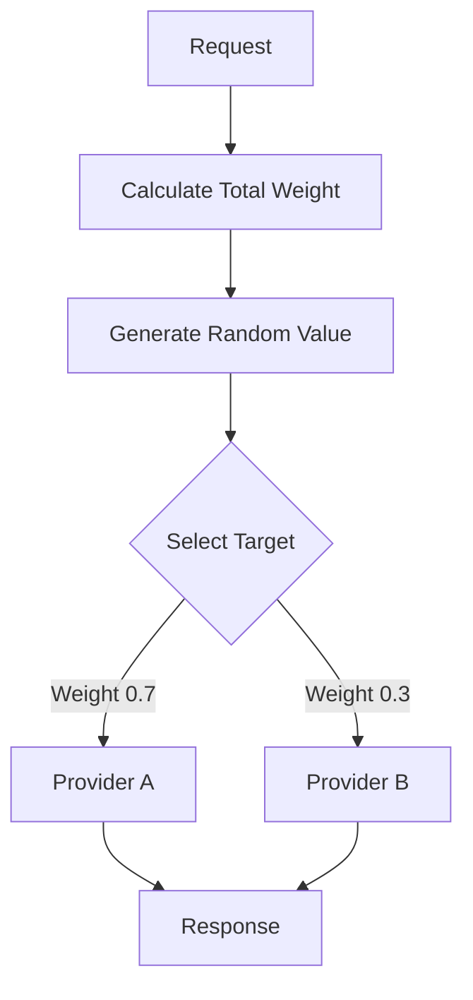
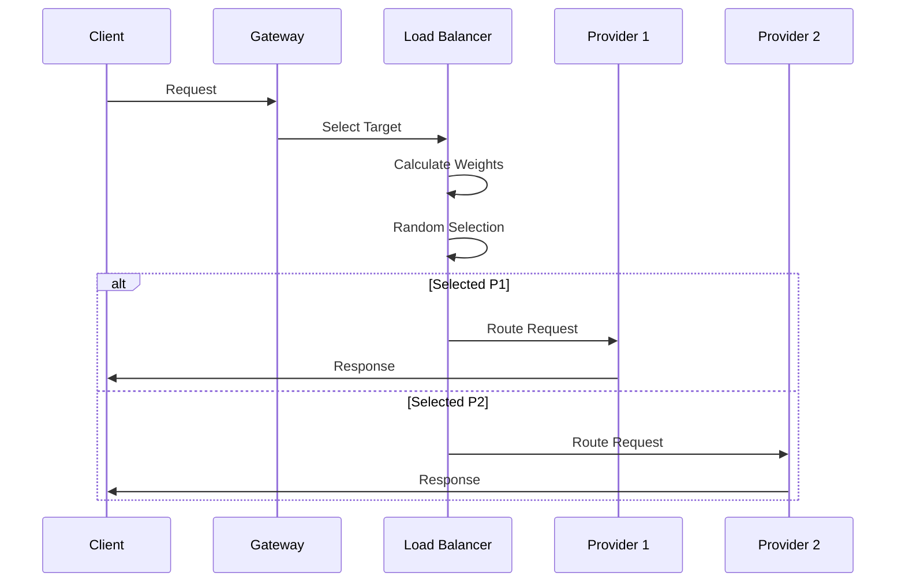

Load balancing allows you to distribute LLM requests across multiple providers or API keys to optimize for availability, cost, performance, and rate limit management.

## How Load Balancing Works

The gateway uses weighted random selection to distribute requests:

1. **Assign weights** to each target (default: 1)
2. **Calculate total weight** across all targets
3. **Generate random value** between 0 and total weight
4. **Select target** by iterating and subtracting weights



## Configuration

### Basic Load Balancing

Distribute requests equally across targets:

```json
{
  "strategy": {
    "mode": "loadbalance"
  },
  "targets": [
    {
      "provider": "openai",
      "api_key": "sk-1"
    },
    {
      "provider": "openai",
      "api_key": "sk-2"
    },
    {
      "provider": "openai",
      "api_key": "sk-3"
    }
  ]
}
```

Each target receives approximately 33% of requests.

### Weighted Load Balancing

Control the distribution with explicit weights:

```json
{
  "strategy": {
    "mode": "loadbalance"
  },
  "targets": [
    {
      "provider": "openai",
      "api_key": "sk-1",
      "weight": 0.7
    },
    {
      "provider": "anthropic",
      "api_key": "sk-ant-1",
      "weight": 0.2
    },
    {
      "provider": "groq",
      "api_key": "gsk-1",
      "weight": 0.1
    }
  ]
}
```

Distribution:
- OpenAI: 70% of requests
- Anthropic: 20% of requests
- Groq: 10% of requests

### Cross-Provider Load Balancing

Balance across different providers:

```json
{
  "strategy": {
    "mode": "loadbalance"
  },
  "targets": [
    {
      "provider": "openai",
      "api_key": "sk-...",
      "weight": 0.5,
      "override_params": {
        "model": "gpt-4o-mini"
      }
    },
    {
      "provider": "anthropic",
      "api_key": "sk-ant-...",
      "weight": 0.5,
      "override_params": {
        "model": "claude-3-5-haiku-20241022"
      }
    }
  ]
}
```

<Note>
When load balancing across providers, ensure the models have similar capabilities to maintain consistent user experience.
</Note>

## Weight Selection Algorithm

The gateway implements weighted random selection:

```typescript
function selectProviderByWeight(providers: Options[]): Options {
  // Default weight to 1 if not specified
  providers = providers.map(provider => ({
    ...provider,
    weight: provider.weight ?? 1
  }));
  
  // Calculate total weight
  const totalWeight = providers.reduce(
    (sum, provider) => sum + provider.weight,
    0
  );
  
  // Generate random value
  let randomWeight = Math.random() * totalWeight;
  
  // Select provider
  for (const [index, provider] of providers.entries()) {
    if (randomWeight < provider.weight) {
      return { ...provider, index };
    }
    randomWeight -= provider.weight;
  }
  
  throw new Error('No provider selected, please check the weights');
}
```

Source: `src/handlers/handlerUtils.ts:204-231`

### Weight Normalization

Weights don't need to sum to 1.0 - they can be any positive numbers:

```json
// These are equivalent:
{
  "targets": [
    { "weight": 0.5 },
    { "weight": 0.5 }
  ]
}

{
  "targets": [
    { "weight": 1 },
    { "weight": 1 }
  ]
}

{
  "targets": [
    { "weight": 50 },
    { "weight": 50 }
  ]
}
```

The gateway normalizes weights internally based on their proportions.

## Use Cases

### Rate Limit Management

Distribute load across multiple API keys to avoid rate limits:

```json
{
  "strategy": { "mode": "loadbalance" },
  "targets": [
    { "provider": "openai", "api_key": "sk-1" },
    { "provider": "openai", "api_key": "sk-2" },
    { "provider": "openai", "api_key": "sk-3" },
    { "provider": "openai", "api_key": "sk-4" },
    { "provider": "openai", "api_key": "sk-5" }
  ]
}
```

With 5 API keys, you can handle 5x the rate limit of a single key.

### Cost Optimization

Route to cheaper providers while maintaining a fallback:

```json
{
  "strategy": { "mode": "loadbalance" },
  "targets": [
    {
      "provider": "groq",
      "api_key": "gsk-...",
      "weight": 0.8,
      "override_params": { "model": "llama-3.3-70b-versatile" }
    },
    {
      "provider": "openai",
      "api_key": "sk-...",
      "weight": 0.2,
      "override_params": { "model": "gpt-4o-mini" }
    }
  ]
}
```

Send 80% of traffic to cheaper Groq, 20% to OpenAI.

### A/B Testing Models

Test different models with controlled traffic splits:

```json
{
  "strategy": { "mode": "loadbalance" },
  "targets": [
    {
      "provider": "openai",
      "api_key": "sk-...",
      "weight": 0.9,
      "override_params": { "model": "gpt-4o-mini" }
    },
    {
      "provider": "openai",
      "api_key": "sk-...",
      "weight": 0.1,
      "override_params": { "model": "gpt-4o" }
    }
  ]
}
```

Test the new model with 10% of traffic before full rollout.

### Geographic Distribution

Route to region-specific endpoints:

```json
{
  "strategy": { "mode": "loadbalance" },
  "targets": [
    {
      "provider": "azure-openai",
      "api_key": "...",
      "resource_name": "us-east-openai",
      "weight": 0.5
    },
    {
      "provider": "azure-openai",
      "api_key": "...",
      "resource_name": "eu-west-openai",
      "weight": 0.5
    }
  ]
}
```

## Combining with Other Strategies

### Load Balance + Fallback

Balance across primary keys, fallback to secondary provider:

```json
{
  "strategy": { "mode": "fallback" },
  "targets": [
    {
      "strategy": { "mode": "loadbalance" },
      "targets": [
        { "provider": "openai", "api_key": "sk-1", "weight": 0.5 },
        { "provider": "openai", "api_key": "sk-2", "weight": 0.5 }
      ]
    },
    {
      "provider": "anthropic",
      "api_key": "sk-ant-..."
    }
  ]
}
```

**Flow:**
1. Load balance between sk-1 and sk-2
2. If both fail, fall back to Anthropic

### Load Balance + Retry

Add retries to each load-balanced target:

```json
{
  "strategy": { "mode": "loadbalance" },
  "retry": { "attempts": 3 },
  "targets": [
    { "provider": "openai", "api_key": "sk-1" },
    { "provider": "openai", "api_key": "sk-2" },
    { "provider": "openai", "api_key": "sk-3" }
  ]
}
```

Each selected target will retry up to 3 times before failing.

### Load Balance + Cache

```json
{
  "cache": { "mode": "simple", "max_age": 3600000 },
  "strategy": { "mode": "loadbalance" },
  "targets": [
    { "provider": "openai", "api_key": "sk-1", "weight": 0.5 },
    { "provider": "openai", "api_key": "sk-2", "weight": 0.5 }
  ]
}
```

Cache hits skip load balancing entirely, saving both latency and costs.

## Implementation Details

### Weight Processing

When entering loadbalance mode:

```typescript
case StrategyModes.LOADBALANCE:
  // Set default weight of 1 for targets without weights
  currentTarget.targets.forEach((t: Options) => {
    if (t.weight === undefined) {
      t.weight = 1;
    }
  });
  
  // Calculate total weight
  let totalWeight = currentTarget.targets.reduce(
    (sum: number, provider: any) => sum + provider.weight,
    0
  );
  
  // Select provider by weight
  const selectedProvider = selectProviderByWeight(
    currentTarget.targets
  );
```

Source: `src/handlers/handlerUtils.ts:693-712`

### Request Flow



### Circuit Breaker Integration

Load balancing integrates with circuit breakers to exclude unhealthy targets:

```typescript
const isHandlingCircuitBreaker = currentInheritedConfig.id;
if (isHandlingCircuitBreaker) {
  const healthyTargets = (currentTarget.targets || [])
    .map((t: any, index: number) => ({
      ...t,
      originalIndex: index,
    }))
    .filter((t: any) => !t.isOpen);  // Filter out open (unhealthy) targets
  
  if (healthyTargets.length) {
    currentTarget.targets = healthyTargets;
  }
}
```

Source: `src/handlers/handlerUtils.ts:646-658`

Unhealthy targets are automatically removed from the load balancing pool.

## Monitoring and Metrics

### Request Distribution

With proper weights, distribution should match configured percentages over time:

```python
# For weight configuration:
# Provider A: 0.7, Provider B: 0.3

# Expected over 1000 requests:
# Provider A: ~700 requests
# Provider B: ~300 requests
```

### Actual Distribution

Monitor actual distribution to ensure weights are working:

```typescript
const distribution = {
  'provider-1': 0,
  'provider-2': 0,
  'provider-3': 0
};

// Track each request
const selectedProvider = selectProviderByWeight(targets);
distribution[selectedProvider.provider]++;
```

<Note>
Small sample sizes may show variance from expected distribution. Statistical convergence occurs over hundreds or thousands of requests.
</Note>

## Best Practices

<CardGroup cols={2}>

<Card title="Start with Equal Weights" icon="scale-balanced">
  Begin with equal distribution and adjust based on performance data.
</Card>

<Card title="Monitor Provider Health" icon="heart-pulse">
  Track error rates and latency per provider to inform weight adjustments.
</Card>

<Card title="Use Fallbacks Too" icon="shield">
  Combine load balancing with fallbacks for maximum reliability.
</Card>

<Card title="Test Weight Changes" icon="flask">
  Gradually adjust weights and monitor impact before large changes.
</Card>

</CardGroup>

## Performance Characteristics

### Selection Overhead

- **Weight calculation:** O(n) where n = number of targets
- **Random selection:** O(n) worst case
- **Total overhead:** < 0.1ms for typical configs

### Memory Usage

Minimal per-request overhead:
- Weight array: 8 bytes per target
- Random value: 8 bytes
- Selected index: 4 bytes

### Distribution Quality

The gateway uses `Math.random()` which provides:
- Uniform distribution
- Sufficient randomness for load balancing
- Fast execution (< 0.01ms)

## Common Patterns

### Primary-Secondary Split

```json
{
  "targets": [
    { "provider": "openai", "api_key": "primary", "weight": 0.9 },
    { "provider": "anthropic", "api_key": "secondary", "weight": 0.1 }
  ]
}
```

Use secondary provider to validate primary or test alternatives.

### Multi-Key Rate Limit Avoidance

```json
{
  "targets": [
    { "provider": "openai", "api_key": "key-1" },
    { "provider": "openai", "api_key": "key-2" },
    { "provider": "openai", "api_key": "key-3" },
    { "provider": "openai", "api_key": "key-4" }
  ]
}
```

Each key gets 25% of traffic, avoiding rate limits.

### Cost-Performance Trade-off

```json
{
  "targets": [
    { "provider": "groq", "weight": 0.6, "override_params": { "model": "llama-3" } },
    { "provider": "openai", "weight": 0.4, "override_params": { "model": "gpt-4o" } }
  ]
}
```

Balance cost (Groq) with quality (OpenAI).

## Next Steps

<CardGroup cols={2}>

<Card title="Routing" icon="route" href="/concepts/routing">
  Learn about other routing strategies like fallback and conditional.
</Card>

<Card title="Configs" icon="gear" href="/concepts/configs">
  Master the complete configuration system.
</Card>

<Card title="Retries" icon="rotate" href="/features/retries">
  Add retries to load-balanced requests.
</Card>

<Card title="Providers" icon="plug" href="/concepts/providers">
  Understand provider capabilities for load balancing.
</Card>

</CardGroup>