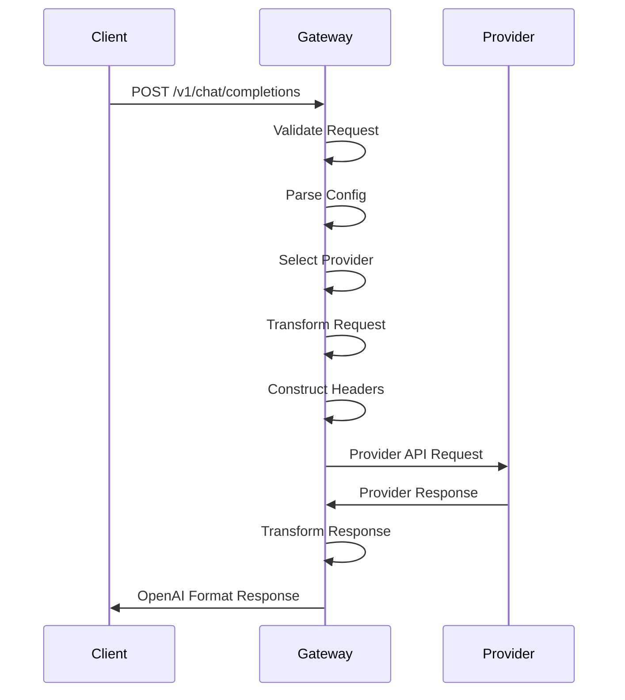

The Portkey AI Gateway uses a modular provider system that enables routing to 250+ LLMs through a unified interface. Each provider is implemented as a self-contained module with standardized transformations.

## Provider Architecture

Every provider integration follows a consistent structure:

```
src/providers/{provider-name}/
├── index.ts           # Provider configuration export
├── api.ts            # API endpoint and header configuration  
├── chatComplete.ts   # Chat completions transformation
├── complete.ts       # Text completions transformation
├── embed.ts          # Embeddings transformation
├── imageGenerate.ts  # Image generation transformation
└── ...
```

### Provider Config Interface

Each provider exports a `ProviderConfigs` object:

```typescript
const OpenAIConfig: ProviderConfigs = {
  api: OpenAIAPIConfig,
  chatComplete: OpenAIChatCompleteConfig,
  complete: OpenAICompleteConfig,
  embed: OpenAIEmbedConfig,
  imageGenerate: OpenAIImageGenerateConfig,
  responseTransforms: {
    chatComplete: OpenAIChatCompleteResponseTransform,
    complete: OpenAICompleteResponseTransform,
    embed: OpenAIEmbedResponseTransform,
  },
  requestTransforms: {
    // Optional request transformations
  }
}
```

Source: `src/providers/openai/index.ts:50-103`

## Request Flow

When a request comes in, the gateway:

1. **Validates the request** using the request validator middleware
2. **Parses the config** to determine the provider and routing strategy
3. **Selects a provider** based on the routing mode (single, loadbalance, fallback, conditional)
4. **Transforms the request** from OpenAI format to provider-specific format
5. **Constructs headers** with provider-specific authentication
6. **Makes the request** to the provider's API
7. **Transforms the response** back to OpenAI-compatible format
8. **Returns the response** to the client



## Request Transformation

The gateway transforms OpenAI-format requests to provider-specific formats:

### Header Transformation

Each provider defines how to map authentication and metadata:

```typescript
// Example: OpenAI headers
const headers = {
  "Authorization": `Bearer ${apiKey}`,
  "OpenAI-Organization": organization,
  "OpenAI-Project": project
}

// Example: Anthropic headers  
const headers = {
  "x-api-key": apiKey,
  "anthropic-version": "2023-06-01"
}
```

Headers are constructed in the provider's `api.ts` file and assembled by `constructRequestHeaders()`.

Source: `src/handlers/handlerUtils.ts:78-159`

### Body Transformation

Request bodies are transformed from OpenAI format to provider format:

```typescript
// OpenAI format (input)
{
  "model": "gpt-4",
  "messages": [{"role": "user", "content": "Hello"}],
  "temperature": 0.7
}

// Anthropic format (transformed)
{
  "model": "claude-3-opus-20240229",
  "messages": [{"role": "user", "content": "Hello"}],
  "temperature": 0.7,
  "max_tokens": 1024
}
```

Transformations handle:
- Model name mapping
- Required vs optional parameters
- Provider-specific defaults
- Format differences (arrays vs objects)

### Content Type Handling

The gateway supports multiple content types:

- **JSON** - Standard request/response format
- **Multipart Form Data** - For file uploads (images, audio)
- **Streaming** - Server-sent events for real-time responses
- **Binary** - For audio and image data

Source: `src/handlers/handlerUtils.ts:41-76`

## Response Transformation

Provider responses are transformed back to OpenAI-compatible format:

```typescript
// Provider response
{
  "id": "msg_123",
  "content": [{"type": "text", "text": "Hello!"}],
  "model": "claude-3-opus-20240229",
  "role": "assistant"
}

// OpenAI format (transformed)
{
  "id": "msg_123",
  "object": "chat.completion",
  "created": 1234567890,
  "model": "claude-3-opus-20240229",
  "choices": [{
    "index": 0,
    "message": {
      "role": "assistant",
      "content": "Hello!"
    },
    "finish_reason": "stop"
  }]
}
```

### Streaming Transformations

For streaming responses, the gateway transforms each chunk:

```typescript
// Provider chunk
data: {"type": "content_block_delta", "delta": {"text": "Hello"}}

// OpenAI chunk (transformed)
data: {"id":"msg_123","object":"chat.completion.chunk","choices":[{"delta":{"content":"Hello"},"index":0}]}
```

Each provider implements streaming transformation functions that parse and transform individual chunks.

## Provider-Specific Features

### OpenAI

- **Organization & Project Headers** - Pass org and project IDs
- **Beta Features** - Support for assistants, threads, etc.
- **Function Calling** - Full function and tool support
- **Vision** - Image analysis in chat completions

### Anthropic

- **Thinking Mode** - Extended reasoning responses
- **System Prompts** - Separate system message handling
- **Message Streaming** - Native streaming events
- **Vision** - Image analysis with base64 or URLs

### Azure OpenAI

- **Deployment IDs** - Map to specific model deployments
- **API Versions** - Version-specific endpoints
- **Auth Modes** - API key, Managed Identity, Entra ID
- **Content Filtering** - Azure-specific content filters

### Google Vertex AI

- **Service Account Auth** - JSON key authentication
- **Project & Region** - Required configuration
- **Safety Settings** - Content safety filters
- **Function Calling** - Google-specific function format

### AWS Bedrock

- **IAM Authentication** - AWS signature v4 signing
- **Model IDs** - Provider-specific model identifiers
- **Streaming** - Event stream parsing
- **Cross-region** - Support for multiple AWS regions

## Custom Providers

For providers with OpenAI-compatible APIs, you can use the proxy mode:

```json
{
  "provider": "openai",
  "api_key": "your-key",
  "custom_host": "https://api.your-provider.com/v1"
}
```

The gateway will use OpenAI transformations with your custom endpoint.

## Provider Selection Logic

The gateway selects providers based on the routing strategy:

### Single Provider

```typescript
const provider = config.provider;
const apiKey = config.api_key;
```

### Load Balanced Providers

```typescript
function selectProviderByWeight(providers: Options[]): Options {
  const totalWeight = providers.reduce((sum, p) => sum + (p.weight ?? 1), 0);
  let randomWeight = Math.random() * totalWeight;
  
  for (const provider of providers) {
    if (randomWeight < provider.weight) {
      return provider;
    }
    randomWeight -= provider.weight;
  }
}
```

Source: `src/handlers/handlerUtils.ts:204-231`

### Fallback Providers

Providers are tried sequentially until one succeeds:

```typescript
for (const target of targets) {
  const response = await tryTarget(target);
  if (response.ok || !shouldFallback(response.status)) {
    return response;
  }
}
```

Source: `src/handlers/handlerUtils.ts:663-690`

## URL Construction

Each provider defines its base URL and endpoint patterns:

```typescript
// OpenAI
const url = `https://api.openai.com/v1/chat/completions`;

// Azure OpenAI
const url = `https://${resourceName}.openai.azure.com/openai/deployments/${deploymentId}/chat/completions?api-version=${apiVersion}`;

// Vertex AI
const url = `https://${region}-aiplatform.googleapis.com/v1/projects/${projectId}/locations/${region}/publishers/google/models/${model}:streamGenerateContent`;
```

URL construction is handled in each provider's context initialization.

## Error Handling

Providers handle errors consistently:

1. **HTTP Errors** - Propagated with original status codes
2. **Transformation Errors** - Wrapped in gateway error format
3. **Provider-Specific Errors** - Normalized to OpenAI error format

```json
{
  "error": {
    "message": "Invalid API key",
    "type": "invalid_request_error",
    "code": "invalid_api_key"
  }
}
```

## Supported Endpoints

Providers can support various endpoints:

- **chatComplete** - Chat completions
- **complete** - Text completions  
- **embed** - Embeddings generation
- **imageGenerate** - Image generation
- **imageEdit** - Image editing
- **createSpeech** - Text-to-speech
- **createTranscription** - Speech-to-text
- **createTranslation** - Audio translation
- **uploadFile** - File uploads
- **createBatch** - Batch processing
- **createFinetune** - Fine-tuning jobs

Not all providers support all endpoints. The gateway returns appropriate errors for unsupported endpoints.

## Best Practices

<CardGroup cols={2}>

<Card title="Test Provider Compatibility" icon="vial">
  Test your use case with each provider as API behaviors may differ.
</Card>

<Card title="Use Fallbacks" icon="shield-halved">
  Configure fallback providers to handle API outages gracefully.
</Card>

<Card title="Monitor Provider Performance" icon="chart-line">
  Track latency and error rates per provider to optimize routing.
</Card>

<Card title="Handle Provider Limits" icon="gauge-high">
  Be aware of rate limits and token limits per provider.
</Card>

</CardGroup>

## Next Steps

<CardGroup cols={2}>

<Card title="Routing" icon="route" href="/concepts/routing">
  Learn about routing strategies for providers.
</Card>

<Card title="Supported Providers" icon="list" href="/providers/supported-providers">
  View the complete list of supported providers.
</Card>

<Card title="Load Balancing" icon="scale-balanced" href="/concepts/load-balancing">
  Distribute load across multiple providers.
</Card>

<Card title="Configs" icon="gear" href="/concepts/configs">
  Configure provider settings and parameters.
</Card>

</CardGroup>