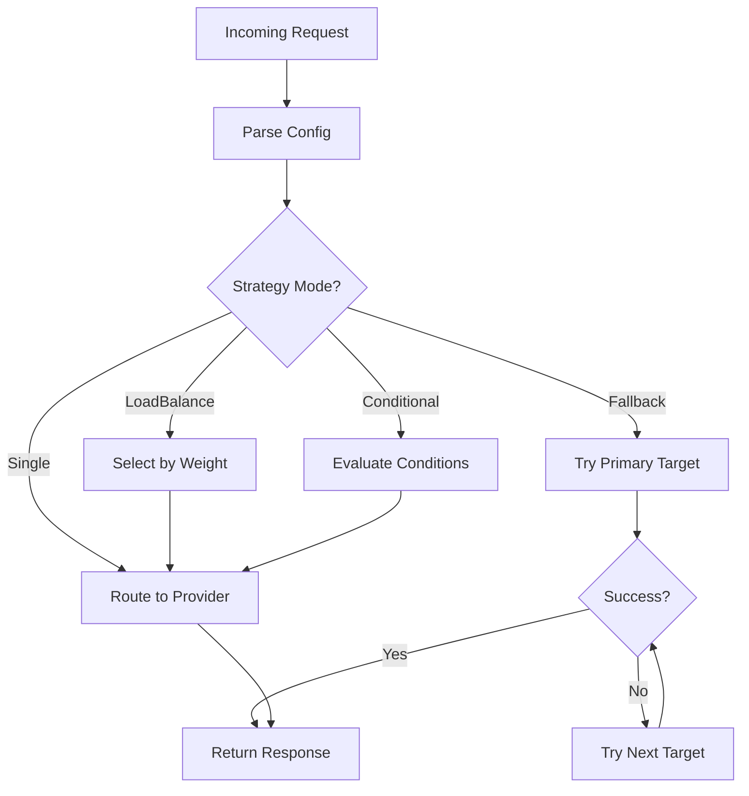

The Portkey AI Gateway provides flexible routing mechanisms to direct requests to different LLM providers based on your requirements. The routing system supports multiple strategies to optimize reliability, performance, and cost.

## Routing Strategies

The gateway supports four routing modes configured through the `strategy.mode` field:

### Single Mode

Routes requests to a single provider. This is the simplest mode and is used when you want direct routing without any failover or distribution logic.

```json
{
  "provider": "openai",
  "api_key": "sk-...",
  "strategy": {
    "mode": "single"
  }
}
```

### Fallback Mode

Automatically falls back to alternative providers when the primary provider fails. The gateway tries each target in sequence until one succeeds.

```json
{
  "strategy": {
    "mode": "fallback",
    "on_status_codes": [429, 500, 502, 503]
  },
  "targets": [
    {
      "provider": "openai",
      "api_key": "sk-..."
    },
    {
      "provider": "anthropic",
      "api_key": "sk-ant-..."
    }
  ]
}
```

**Key Features:**
- Define specific status codes that trigger fallback with `on_status_codes`
- If no status codes are specified, falls back on any non-2xx response
- Stops at the first successful response
- Preserves the original request format

<Note>
Gateway exceptions (internal errors) automatically skip to the next target regardless of `on_status_codes` configuration.
</Note>

### Load Balance Mode

Distributes requests across multiple providers based on assigned weights. This mode is ideal for distributing load, testing multiple providers, or optimizing costs.

```json
{
  "strategy": {
    "mode": "loadbalance"
  },
  "targets": [
    {
      "provider": "openai",
      "api_key": "sk-...",
      "weight": 0.7
    },
    {
      "provider": "anthropic",
      "api_key": "sk-ant-...",
      "weight": 0.3
    }
  ]
}
```

**How Weights Work:**
- Weights determine the probability of selecting each provider
- Default weight is `1` if not specified
- A provider with weight `0.7` receives approximately 70% of requests
- The gateway uses probabilistic selection based on total weight

See the [Load Balancing](/concepts/load-balancing) page for more details.

### Conditional Mode

Routes requests based on dynamic conditions evaluated at runtime. This allows for intelligent routing based on request parameters.

```json
{
  "strategy": {
    "mode": "conditional",
    "conditions": [
      {
        "query": { "model": "gpt-4" },
        "then": "openai_target"
      },
      {
        "query": { "model": "claude-3" },
        "then": "anthropic_target"
      }
    ],
    "default": "fallback_target"
  },
  "targets": [
    {
      "id": "openai_target",
      "provider": "openai",
      "api_key": "sk-..."
    },
    {
      "id": "anthropic_target",
      "provider": "anthropic",
      "api_key": "sk-ant-..."
    },
    {
      "id": "fallback_target",
      "provider": "groq",
      "api_key": "gsk_..."
    }
  ]
}
```

**Conditional Routing Features:**
- Evaluate request parameters using JSON path queries
- Route to specific named targets based on conditions
- Define a default target for unmatched conditions
- Combine with other routing strategies within targets

## Request Flow

The routing system processes requests through the following pipeline:



## Advanced Routing

### Nested Strategies

You can nest routing strategies to create sophisticated routing logic:

```json
{
  "strategy": { "mode": "fallback" },
  "targets": [
    {
      "strategy": { "mode": "loadbalance" },
      "targets": [
        { "provider": "openai", "api_key": "sk-1", "weight": 0.5 },
        { "provider": "openai", "api_key": "sk-2", "weight": 0.5 }
      ]
    },
    {
      "provider": "anthropic",
      "api_key": "sk-ant-..."
    }
  ]
}
```

This config first load balances between two OpenAI keys, then falls back to Anthropic if both fail.

### Circuit Breaker Integration

The routing system integrates with circuit breakers to automatically exclude unhealthy targets. When a target is marked as "open" (unhealthy), it's automatically filtered from the available targets.

Source: `src/handlers/handlerUtils.ts:646-658`

## Provider Selection

The gateway's provider selection logic is implemented in `selectProviderByWeight()` which:

1. Assigns default weight of 1 to providers without specified weights
2. Calculates total weight across all providers
3. Selects a random value between 0 and total weight
4. Iterates through providers subtracting their weights until the random value is consumed

Source: `src/handlers/handlerUtils.ts:204-231`

## Custom Host Routing

For providers with custom deployments, you can specify a custom host:

```json
{
  "provider": "openai",
  "api_key": "sk-...",
  "custom_host": "https://your-custom-endpoint.com"
}
```

The custom host must be a valid URL format and is validated during request processing.

## Best Practices

<CardGroup cols={2}>

<Card title="Use Fallbacks for Reliability" icon="shield">
  Configure fallback targets to prevent downtime when a provider experiences issues.
</Card>

<Card title="Load Balance for Scale" icon="arrows-split-up-and-left">
  Distribute load across multiple API keys or providers to avoid rate limits.
</Card>

<Card title="Test Conditional Logic" icon="flask">
  Thoroughly test conditional routing rules before production use.
</Card>

<Card title="Monitor Target Health" icon="heart-pulse">
  Use circuit breakers to automatically exclude unhealthy targets.
</Card>

</CardGroup>

## Next Steps

<CardGroup cols={2}>

<Card title="Configs" icon="gear" href="/concepts/configs">
  Learn how to structure and manage gateway configurations.
</Card>

<Card title="Load Balancing" icon="scale-balanced" href="/concepts/load-balancing">
  Deep dive into load balancing strategies and weight distribution.
</Card>

<Card title="Providers" icon="plug" href="/concepts/providers">
  Understand the provider system architecture.
</Card>

<Card title="Retries" icon="rotate" href="/features/retries">
  Configure automatic retries for failed requests.
</Card>

</CardGroup>