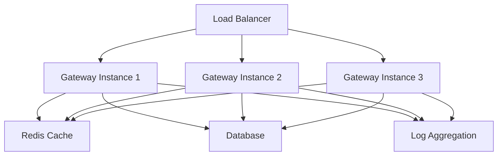

Make your AI app more reliable and forward compatible, while ensuring complete data security and privacy with Portkey's Enterprise deployment options.

## Enterprise Features

Portkey's enterprise deployment includes advanced features beyond the open-source gateway:

### Security & Compliance

<CardGroup cols={2}>
  <Card title="Secure Key Management" icon="key">
    Role-based access control and tracking for API keys
  </Card>
  
  <Card title="Access Control" icon="shield">
    IP and geo-based inbound rules to control deployments
  </Card>
  
  <Card title="PII Redaction" icon="user-secret">
    Automatically remove sensitive data from requests
  </Card>
  
  <Card title="Compliance" icon="certificate">
    SOC2, ISO, HIPAA, GDPR compliant infrastructure
  </Card>
</CardGroup>

### Performance & Optimization

<CardGroup cols={2}>
  <Card title="Semantic Caching" icon="database">
    Serve repeat queries faster and save costs
  </Card>
  
  <Card title="Load Balancing" icon="scale-balanced">
    Advanced routing and failover strategies
  </Card>
  
  <Card title="Rate Limiting" icon="gauge">
    Sophisticated rate limiting and quota management
  </Card>
  
  <Card title="Custom Routing" icon="route">
    Dynamic routing based on content and metadata
  </Card>
</CardGroup>

### Support & SLA

<CardGroup cols={2}>
  <Card title="Professional Support" icon="headset">
    Dedicated support team and feature prioritization
  </Card>
  
  <Card title="99.99% Uptime SLA" icon="clock">
    Guaranteed uptime with financial backing
  </Card>
  
  <Card title="Custom Integrations" icon="plug">
    Tailored integrations for your infrastructure
  </Card>
  
  <Card title="Training & Onboarding" icon="graduation-cap">
    Comprehensive training for your team
  </Card>
</CardGroup>

## Deployment Options

### Managed Enterprise

Portkey hosts and manages the gateway infrastructure in isolated environments:

**Benefits:**
- No infrastructure management required
- Automatic scaling and updates
- 24/7 monitoring and support
- Regional deployment options
- Custom domain and branding

**Ideal for:** Organizations that want enterprise features without infrastructure overhead.

### Private Cloud

Deploy the enhanced gateway in your own cloud environment:

**Supported Platforms:**
- AWS (ECS, EKS, Lambda)
- Google Cloud (GKE, Cloud Run)
- Azure (AKS, Container Instances)
- Private Kubernetes clusters

**Benefits:**
- Full data sovereignty
- VPC integration
- Compliance with data residency requirements
- Custom security policies

**Ideal for:** Organizations with strict data residency or compliance requirements.

### On-Premises

Deploy within your own data centers:

**Deployment Methods:**
- Kubernetes clusters
- VM-based deployments
- Bare metal servers

**Benefits:**
- Complete control over infrastructure
- Air-gapped deployments possible
- Integration with existing systems
- Custom hardware configurations

**Ideal for:** Organizations requiring on-premises deployment for security or compliance.

## Architecture

### High Availability Setup

### Multi-Region Deployment

Deploy across multiple regions for global low-latency access:

- **Active-Active:** Multiple regions handling traffic simultaneously
- **Active-Passive:** Primary region with standby for disaster recovery
- **Geo-Routing:** Route users to nearest region automatically

## Security Features

### Network Security

- **VPC Peering** - Direct connection to your infrastructure
- **Private Endpoints** - Access gateway without public internet
- **IP Allowlisting** - Restrict access to specific IP ranges
- **WAF Integration** - Web application firewall protection

### Data Security

- **Encryption at Rest** - All stored data encrypted with AES-256
- **Encryption in Transit** - TLS 1.3 for all connections
- **Key Rotation** - Automatic rotation of encryption keys
- **Audit Logging** - Comprehensive audit trails for compliance

### Authentication & Authorization

- **SSO Integration** - SAML, OAuth, OIDC support
- **RBAC** - Role-based access control for teams
- **API Key Management** - Hierarchical key structure with scoping
- **MFA** - Multi-factor authentication for admin access

## Monitoring & Observability

### Metrics

- Request volume and latency
- Error rates by provider
- Token usage and costs
- Cache hit rates
- Custom business metrics

### Logging

Integration with enterprise logging platforms:

- **Datadog** - Full integration with traces and metrics
- **Splunk** - Structured log forwarding
- **ELK Stack** - Elasticsearch, Logstash, Kibana
- **CloudWatch** - AWS native logging

### Alerting

Customizable alerts for:

- Error rate thresholds
- Latency spikes
- Cost anomalies
- Security events
- Service health

## Getting Started

<Steps>
  <Step title="Schedule a consultation">
    [Book a call](https://calendly.com/portkey-ai/quick-meeting?utm_source=github&utm_campaign=install_page) with our team to discuss your requirements.
  </Step>
  
  <Step title="Architecture design">
    Work with our solutions architects to design your deployment:
    - Infrastructure requirements
    - Security and compliance needs
    - Integration points
    - Scaling strategy
  </Step>
  
  <Step title="Proof of concept">
    Run a pilot deployment to validate:
    - Performance benchmarks
    - Integration compatibility
    - Team training needs
  </Step>
  
  <Step title="Production deployment">
    Deploy to production with:
    - Dedicated implementation support
    - Load testing and validation
    - Team training sessions
    - Go-live support
  </Step>
  
  <Step title="Ongoing support">
    Receive continuous support:
    - 24/7 technical support
    - Regular health checks
    - Feature updates
    - Performance optimization
  </Step>
</Steps>

## Managed Service Benefits

Consider Portkey's managed service for production deployments:

### Production Proven

Portkey runs this same Gateway on our API and processes **billions of tokens** daily. Our managed service is in production with:

- **Postman** - API development platform
- **Haptik** - Conversational AI platform
- **Turing** - AI-powered talent cloud
- **MultiOn** - AI agent platform
- **SiteGPT** - Customer support AI

### Included Services

- **Infrastructure Management** - No servers to manage
- **Automatic Scaling** - Handle traffic spikes effortlessly
- **Security Updates** - Automatic patching and updates
- **Monitoring** - Built-in dashboards and alerts
- **Support** - Enterprise-grade support included

## Pricing

Enterprise pricing is customized based on:

- Deployment model (managed, private cloud, on-premises)
- Request volume
- Number of users/teams
- Support level
- Additional features

### What's Included

- Unlimited requests (managed deployments)
- All enterprise features
- Professional support
- Training and onboarding
- Custom integrations
- SLA guarantees

## Case Studies

### Financial Services

**Challenge:** Strict data residency requirements and high compliance standards.

**Solution:** On-premises deployment with custom audit logging and PII redaction.

**Results:**
- 100% data sovereignty
- Passed SOC2 and ISO audits
- 99.99% uptime achieved

### Healthcare Platform

**Challenge:** HIPAA compliance and secure PHI handling.

**Solution:** Private cloud deployment in AWS with VPC integration.

**Results:**
- HIPAA compliant infrastructure
- Automatic PHI detection and redaction
- Reduced costs by 40% with caching

### E-commerce

**Challenge:** Global user base requiring low latency worldwide.

**Solution:** Multi-region managed deployment with geo-routing.

**Results:**
- Less than 100ms latency globally
- 10x request volume during sales events
- Zero downtime deployments

## Support Channels

### Technical Support

- **Email:** enterprise@portkey.ai
- **Slack Connect:** Dedicated channel for your team
- **Phone:** 24/7 hotline for critical issues
- **On-call:** Dedicated on-call engineer for P1 incidents

### Resources

- Private documentation portal
- Architecture review sessions
- Quarterly business reviews
- Training materials and workshops

## Next Steps

<CardGroup cols={2}>
  <Card title="Schedule a Call" icon="calendar" href="https://calendly.com/portkey-ai/quick-meeting">
    Discuss enterprise deployment options with our team
  </Card>
  
  <Card title="Sign Up" icon="rocket" href="https://app.portkey.ai/">
    Start with managed deployment - free developer plan available
  </Card>
  
  <Card title="Documentation" icon="book" href="https://portkey.ai/docs">
    Explore the full API documentation
  </Card>
  
  <Card title="GitHub" icon="github" href="https://github.com/portkey-ai/gateway">
    View the open-source gateway code
  </Card>
</CardGroup>